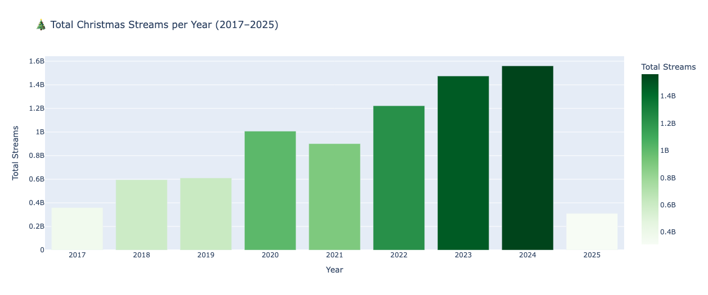
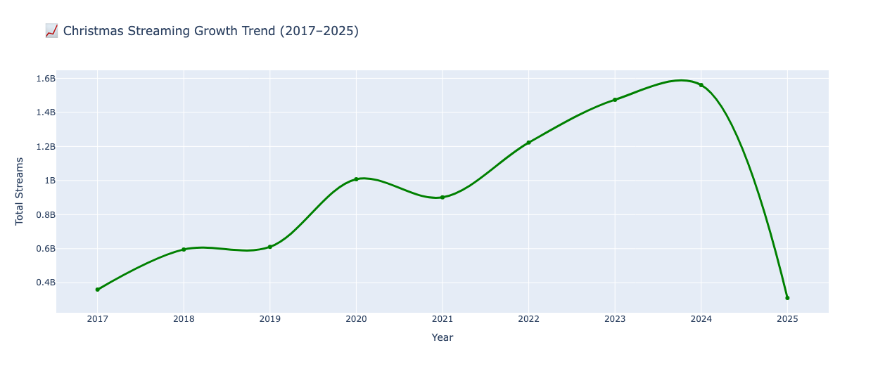
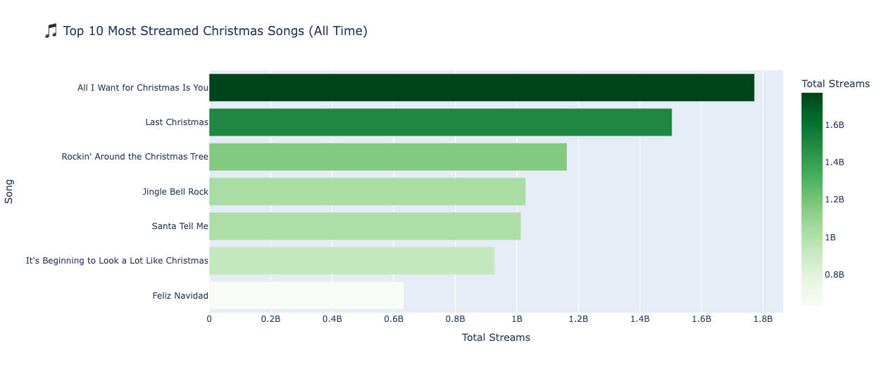
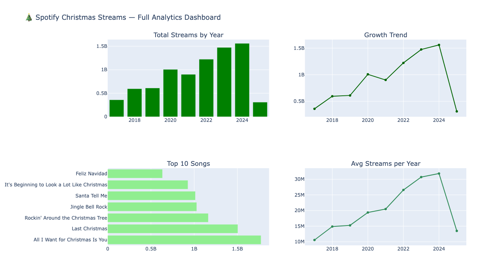

# spotify-streaming-analytics-pipeline
Python data analytics pipeline analyzing Spotify streaming trends with SQL, Pandas, Matplotlib, Plotly dashboards, and Fernet encryption.
## Project Overview

This project builds a Python data analytics pipeline to analyze Spotify streaming trends between 2017–2025.

The workflow includes:
- Data processing using Pandas
- SQL-style data analysis using Pandas
- Interactive visualizations with Plotly
- Secure data handling using Fernet encryption
  
## Dashboard Preview

### Total Streams by Year

### Growth Trend

### Top Songs

### Average Streams

